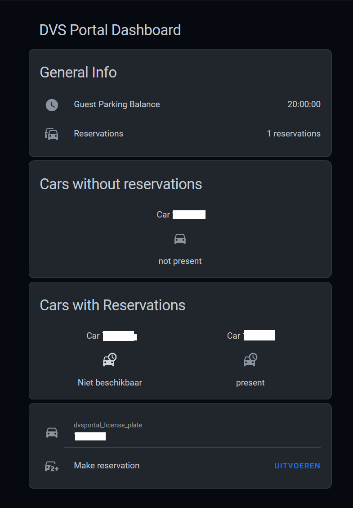

# DVS Portal Integration for Home Assistant

This integration is designed for the parking system commonly used by Dutch municipalities. It provides various sensors and functionalities to interact with the parking system directly from your Home Assistant instance.

[Read here how](DASHBOARD.md)

## Features

- **Balance Sensor**: Shows the remaining balance for guest parking.
- **Active Reservations Sensor**: Displays the number of active and future reservations.
- **Car Sensors**: Dynamic sensors for each known license plate, showing its current state.

## Installation

For now, you'll have to manually add this repository to HACS:

1. Open HACS in Home Assistant.
2. Go to Integrations.
3. Click on the three dots in the top right corner and choose "Custom Repositories".
4. Add the URL of this repository.
5. Choose "Integration" as the category.
6. Click "Add".

After that, you can install it like any other HACS integration.

## Sensors

### Balance Sensor

- **State**: Remaining balance in minutes.
- **Attributes**: Additional information about the balance.

### Active Reservations Sensor

- **State**: Total number of active and future reservations.
- **Attributes**: Lists of license plates for current and future reservations.

### Car Sensors

- **State**: Can be one of the following:
  - `not present`: No active reservation.
  - `present`: Currently has an active reservation.
  - `reserved`: Has a future reservation.
- **Attributes**: Various details about the reservation and license plate.

## Credits

This integration was built upon the DVS Portal API implementation by [tcoenraad](https://github.com/tcoenraad). The original API can be found [here](https://github.com/tcoenraad/python-dvsportal).

## Author

This integration was created by [chessspider](https://github.com/chessspider).

## Issues and Contributions

For issues, feature requests, and contributions, please use the [GitHub Issue Tracker](https://github.com/chessspider/dvsportal/issues).
